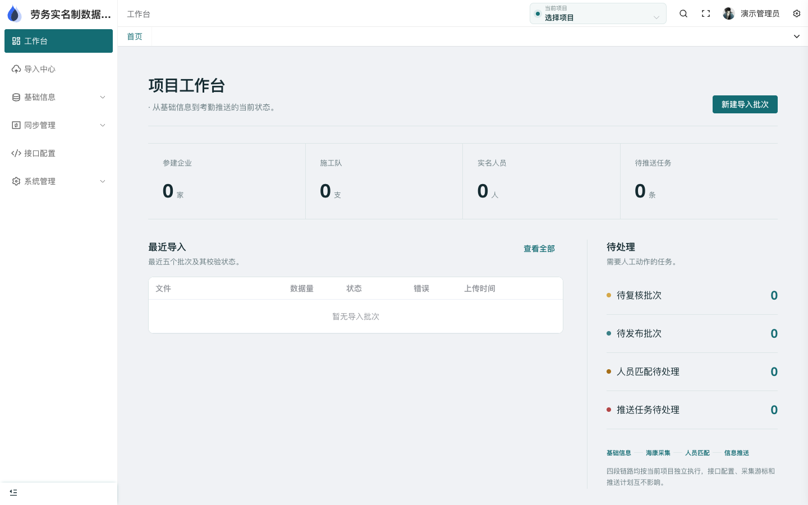
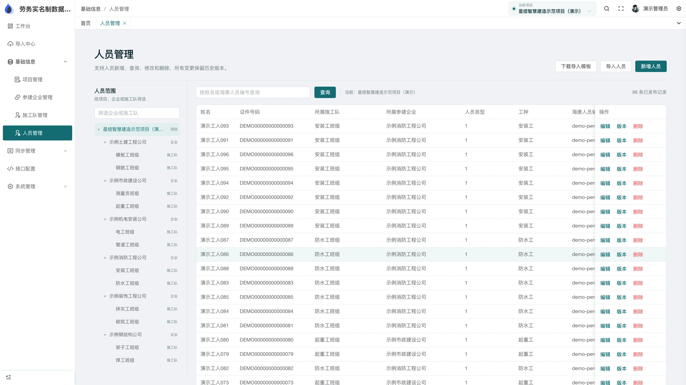

# 劳务实名制系统

[](LICENSE) [](https://vuejs.org/) [](https://www.oracle.com/java/technologies/javase/jdk17-archive-downloads.html)

面向工程项目的劳务实名制与考勤管理系统。按项目组织企业、班组和人员台账，将 Excel 导入、考勤采集、人员匹配、平台推送与审计记录串联起来。

[界面预览](#界面预览) · [在线体验](#在线体验) · [快速开始](#快速开始) · [文档](#文档) · [作者作品集](http://43.156.229.191:8080/portfolio/)

> 公开仓库提供通用源码、迁移脚本和 Mock 适配器，不包含真实人员、身份证、照片、考勤记录或平台凭据。真实设备与劳务平台接入需按项目协议单独验收。

## 功能

- **项目工作区**：项目、企业、班组和人员台账按工作区隔离。
- **数据导入**：Excel 导入、校验、复核、发布和错误反馈。
- **考勤管理**：采集、匹配、统计、补全、复核和按日查询。
- **平台推送**：依赖顺序、幂等任务、失败补偿、重试和调用日志。
- **权限与审计**：角色、菜单、项目成员、操作日志和敏感字段加密。
- **Mock 联调**：本地可使用 Mock 网关验证采集、匹配和推送流程。

## 技术栈

| 层 | 技术 |
| --- | --- |
| 管理端 | Vue 3、TypeScript、Vite、Element Plus、Pinia |
| 后端 | Java 17、Spring Boot、Flyway、JPA、Maven |
| 基础设施 | MySQL、Maven、HTTP 集成适配 |

## 界面预览

### 项目工作台：项目、企业、班组与待处理任务



### 人员管理：项目范围、企业班组和实名人员记录



截图来自公开演示或已脱敏的项目素材，展示功能界面与交互重点；线上版本与原型图片可能随维护变化。
## 在线体验

- [劳务实名制系统在线演示](http://43.156.229.191:8848/labor-admin/)
- 演示入口需要登录；人员、企业与考勤使用演示数据。

请勿上传真实身份证、人员照片，或在体验环境配置真实采集与推送任务。

## 快速开始

### 环境要求

Git、JDK 17、Maven、MySQL、pnpm ≥9。管理端要求 Node `^20.19.0 || >=22.13.0`，可使用仓库 `.nvmrc` 指定的 Node 版本。

### 1. 获取代码

```bash
git clone https://github.com/WuZhaohui1993/labor-public.git
cd labor-public
```

### 2. 准备依赖与配置

后端 [pom.xml](labor-server/pom.xml) 引用了 `com.hikvision.ga:artemis-http-client:1.1.15.RELEASE`，请自行取得授权并配置 Maven 依赖来源。Mock 只切换运行时集成行为，不能免除编译依赖。

配置以 [application.yml](labor-server/src/main/resources/application.yml) 为准。将以下变量注入启动进程：

| 配置 | 用途 |
| --- | --- |
| `DB_URL`、`DB_USER`、`DB_PASSWORD` | 专用 MySQL 数据库 |
| `JWT_SECRET`、`BOOTSTRAP_ADMIN_PASSWORD` | 登录令牌与初始管理员密码 |
| `APP_DATA_ENCRYPTION_KEY`、`APP_ID_HASH_KEY` | 敏感字段加密与身份摘要 |
| `CORS_ALLOWED_ORIGINS` | 允许的前端来源 |
| `INTEGRATION_MOCK_ENABLED` | 本地 Mock 开关，默认 `true` |
| `SERVER_PORT` | 后端端口，默认 9989 |

现有 `.env.example` 中的 `DB_USERNAME`、`ALLOWED_ORIGINS` 与后端实际读取的变量名不同，使用时分别改为 `DB_USER`、`CORS_ALLOWED_ORIGINS`。Spring Boot 不会自动加载任意 `.env` 文件，应由终端、IDE 或部署工具显式注入。

Flyway 启动时执行 [数据库迁移](labor-server/src/main/resources/db/migration)，JPA 按 `validate` 检查表结构；首次启动使用专用测试库，升级已有环境前先备份。

### 3. 启动后端与管理端

```bash
cd labor-server
./mvnw spring-boot:run
```

另开终端，从仓库根目录执行：

```bash
cd labor-admin
pnpm install
pnpm dev
```

管理端默认开发端口为 8848，API 代理指向 `http://127.0.0.1:9989`。实际访问路径以启动日志和 `VITE_PUBLIC_PATH` 配置为准。

## 测试

安装依赖并准备好上述配置后，在仓库根目录执行：

```bash
cd labor-server
./mvnw test
./mvnw -DskipTests package
cd ..
pnpm --dir labor-admin typecheck
pnpm --dir labor-admin build
git diff --check
```

测试需要 JDK 17、获授权的 SDK 依赖和专用测试数据库。重点复测项目隔离、导入重复数据、考勤匹配、任务幂等与失败重试；本地 Mock 通过不能替代真实平台验收。 `-DskipTests package` 仅表示跳过测试打包，不表示测试通过。

## 文档

- [服务端配置](labor-server/src/main/resources/application.yml)
- [数据库迁移](labor-server/src/main/resources/db/migration)
- [SDK 与后端依赖](labor-server/pom.xml)
- [管理端代理配置](labor-admin/vite.config.ts)
- [参与贡献](CONTRIBUTING.md)
- [安全说明](SECURITY.md)
- [第三方依赖与版权](THIRD_PARTY_NOTICES.md)

## 项目结构

```text
├── labor-admin/            # Vue 3 管理端
├── labor-server/           # Spring Boot 业务、集成与测试
│   └── src/main/resources/db/migration/  # Flyway 迁移
└── docs/assets/            # README 演示截图
```

## 作者与作品集

- [GitHub · WuZhaohui1993](https://github.com/WuZhaohui1993)
- [个人作品集](http://43.156.229.191:8080/portfolio/)
- [问题反馈与功能建议](https://github.com/WuZhaohui1993/labor-public/issues)

欢迎交流使用问题、反馈 Bug 或提出功能建议；项目合作可通过作品集中的联系方式沟通。

## 安全边界

身份证、照片、联系方式与考勤属于受限业务数据，应加密存储并按项目授权。平台 Token、设备密钥由部署环境管理；启用推送前核对字段范围、项目映射、幂等规则和审计保留期限。 更多说明见 [SECURITY.md](SECURITY.md)。

## 参与贡献

请先阅读 [贡献指南](CONTRIBUTING.md)，保持接口、权限、配置和文档同步。反馈问题时附上复现步骤、期望结果和必要截图；提交 PR 时说明实际执行的检查及未覆盖范围，不提交真实业务数据、私有凭据或构建产物。

## 许可证

本项目自有代码采用 [MIT License](LICENSE)。第三方组件、上游代码及厂商 SDK 遵循各自许可证；版权与再分发说明见 [THIRD_PARTY_NOTICES.md](THIRD_PARTY_NOTICES.md)。
